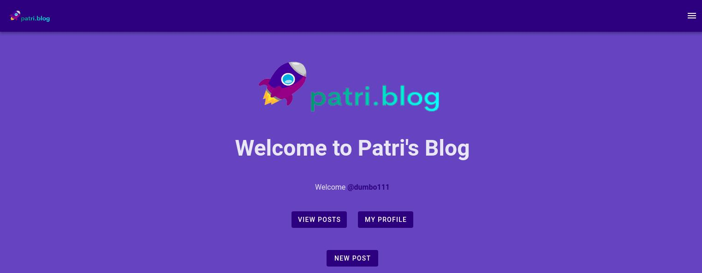

# Blog Practice

## Project's goal
We want to implement a service for **blog management with persistence and REST API**. Blog entries may have comments and avoid the publication of those that may be offensive, the service must include a offensive-words validator.

## Functionalities
The information entities that the blog should manage are:
* **Post**: Each entry contains the following fields: Author's name, Author's nickname, Title, Text, List of comments.
* **Comment**: Each comment contains the following fields: Nickname of the author of the comment, Content, Date of the comment.
* **OffensiveWord**: Each word will have an associated "level" field indicating the severity of the word from 1 to 5. If the comment you are trying to incorporate contains any of the offensive words registered in the database, the comment cannot be created.

## User control

The application has to allow several roles of users:

- _Authenticated_:
  - **Admin**: Admin users can perform any operation of the REST API.
  - **Publisher**: Publisher users can:
    - Create blog entries.
    - Delete and modify only the entries created by them.
    - Delete comments from your posts.
    - Add comments to other posts.
- _No-Authenticated_: They can consult information but cannot add comments or posts.

Any user can register in the application and will be assigned the role of “publisher”.
To do this, you can create a new user profile on `/signup` or login on `/login` routes.

The app implement a Node.js script called defaultUsers.js that will connect to MongoDB and create admin and publisher users when it runs the first time.
For create posts and send comments you need to be logged in.

Your user credentials are stored on browser localStore whit a JWT token condition.

Also the blog has a `/myprofile` view to see your user profile data and your posts.

You can edit or delete only your posts and comments if you have "publisher role". 
If you have "admin role" you have access to all blog functionalities.

## Default Users
You can user these default users profiles to try de app, or create your own user:

**Admin role**
- username: dumbo111
- pass: dumbo111

**Publisher role**
- username: bambi222
- pass: bambi222

## Install dependencies
You can install all dependencies in `package.json` files on one step using for `server/` and `client/` folder:

`npm install`

## Run the App

You need to **run the server** in a terminal with node from `server/` folder:

`npm run start`

The server is running now on safe port [https://localhost:3443](https://localhost:3443).

Open **Postman app** and import `postman.json` and `enviroments.json` files to interact with REST APIs endpoints

Open **MongoDB Compass app** to interact with app database and collections. Connect to [https://localhost:27017](https://localhost:27017). 

If you want to learn more about server structure you can see [server folder](./server/README.md).

---

Also you need to **run the vue client** in other terminal with:

`npm run serve`

The client is running now on safe port [https://localhost:8080](https://localhost:8080).

If you want to learn more about vue client structure you can see [client folder](./client/README.md).

---
Other way to see the app is running `/dist` directory on a **local web server**. Run this commands to try it:

Install serve:

`sudo npm install -g serve`

Run the serve from `/client` folder:

`serve -s dist`

But you also need to run the server in other terminal: `npm run start` from `/server` folder

## Run tests

### Server tests

From `server/` folder, run unit and API REST tests using:

`npm run test`

### Client tests

From `client/` folder, run End2End testing using:

**Warning** Remember to run before the **fake server** using: **`npm run fake-server`** from `server/` folder

`npm run test:e2e`

## Enjoy it :)

